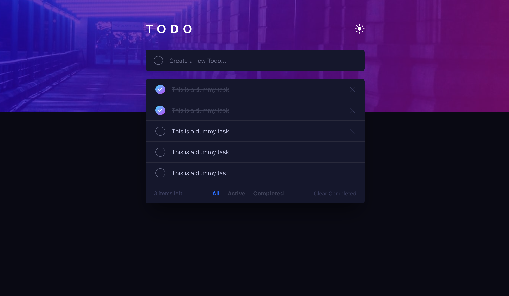

# Frontend Mentor - Todo App Challenge

This is a solution to the [Todo App challenge on Frontend Mentor](https://www.frontendmentor.io/challenges/todo-app-Su1_KokOW/hub). Frontend Mentor challenges help you improve your coding skills by building realistic projects. 

## Table of contents

- [Overview](#overview)
  - [The Challenge]()
  - [Screenshot]()
  - [Built with](#built-with)
- [Author](#author)

### Built with

- Semantic HTML5 markup
- Tailwind CSS
- React + TypeScript

## Author

- Frontend Mentor - [@devhnry](https://www.frontendmentor.io/profile/devhnry)
- Twitter - [@devhnry](https://www.twitter.com/devhnry)

